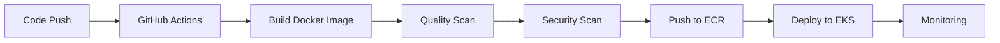

# 👋 Hi there, I'm Deepak  
### 🚀 DevOps Engineer | Cloud & Automation Enthusiast  

I’m passionate about designing scalable infrastructure, automating workflows, and improving deployment reliability.  
Currently exploring advanced CI/CD pipelines, Kubernetes, and cloud-native security best practices.

---

## 🧠 About Me  
- ☁️ Skilled in **AWS**, **Docker**, **Kubernetes**, **Terraform**, **Jenkins**, **GitHub Actions**  
- 🧩 Experienced with **Prometheus**, **Grafana**, **CloudWatch**, **ECR**, **EKS**  
- 💻 Strong Linux background — comfortable with shell scripting & server management  
- 🧱 Hands-on with **Nginx**, **Apache HTTPD**, and **CI/CD automation**  
- 🧠 Constantly learning new DevOps tools & cloud strategies  
- 📫 Reach me at: [LinkedIn](https://www.linkedin.com/in/deepak-kine-10666b32a/) | [Email](mailto:kinedeepak@outlook.com)

---

## 🧰 Tech Stack

| Category | Tools |
|-----------|--------|
| ☁️ Cloud | AWS (EC2, S3, EKS, RDS, CloudFront, IAM, VPC) |
| 🐳 Containers | Docker, Kubernetes, Minikube |
| ⚙️ Automation | Terraform, Jenkins, GitHub Actions |
| 📊 Monitoring | Prometheus, Grafana, CloudWatch |
| 🌐 Web Servers | Nginx, Apache HTTPD |
| 💾 Databases | PGSQL, MongoDB |
| 💻 OS & CLI | Linux (Ubuntu), Bash scripting |

---

## 🧩 Featured Projects

### 🧠 Project 1: APIX (APISecurist)
**Roles & Responsibilities:**
- Designed and managed **Docker-based environments** using Docker Compose for local development and testing.  
- Migrated containerized applications from **Docker Compose to Kubernetes** for scalability and high availability.  
- Deployed and maintained **Kubernetes workloads** (Deployments, Services, ConfigMaps, Secrets, Ingress) on **Minikube** and **AWS EKS**.  
- Built **CI/CD pipelines** in **GitHub Actions** and **Jenkins** to automate builds, Docker image creation, and Kubernetes deployments.  
- Managed and optimized container images using **Docker**, **AWS ECR**, and **GitHub Packages**.  
- Configured **Ingress Nginx** as a reverse proxy and load balancer for routing application traffic.  
- Integrated **Trivy** and **SonarQube** scans into CI/CD workflows for vulnerability detection and code quality checks.  
- Implemented **application monitoring and alerting** using **Prometheus** and **Grafana dashboards**.  
- Automated infrastructure provisioning and environment setup using **Terraform** and **Ansible**.  
- Worked with AWS services (**EC2, S3, VPC, IAM, RDS, EKS**) for hosting and infrastructure management.  
- Created and enforced **backup strategies** for databases and critical workloads.  
- Managed **Git branching and version control strategies**, enabling smooth collaboration between Dev and Ops teams.

---

### 🏗️ AWS Three-Tier Architecture  
- Designed and deployed a secure and scalable **three-tier web app** using AWS services  
- Used **Docker + Kubernetes (EKS)** for container orchestration  
- Automated builds and deployments using **CI/CD pipelines**

### 🔁 Web Hosting Comparison  
- Hosted and compared a website using **Nginx** and **Apache HTTPD**  
- Configured **Nginx** as a reverse proxy and **Apache** for dynamic content

---

## 📈 GitHub Analytics  

  

---

## 🏆 Trophies  

---

## 🛠️ Badges  

---
## ⚙️ CI/CD Pipeline Flow  

  

---

## 📊 Activity Graph  

---

## 👀 Visitor Counter  

---

## 💬 Daily DevOps Quote  

