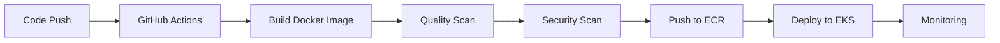

  

<h1 align="center">Hi 👋, I'm Deepak Kine</h1>

<h3 align="center">
🚀 DevOps Engineer | AWS | Docker | Kubernetes | Terraform | CI/CD
</h3>

  

💡 Building scalable cloud infrastructure | ⚙️ Automating deployments | 🔐 DevSecOps Enthusiast  

📍 India | 🎯 Open to DevOps / Cloud Engineer Roles

---

## 🧠 About Me  

✔ Hands-on with **AWS (EKS, EC2, S3, IAM, VPC, RDS, ECR)**  
✔ Containerization & orchestration using **Docker & Kubernetes (EKS, Minikube)**  
✔ CI/CD automation with **GitHub Actions & Jenkins**  
✔ Monitoring & observability using **Prometheus, Grafana & CloudWatch**  
✔ DevSecOps practices using **Trivy & SonarQube**  
✔ Strong in **Linux, Shell Scripting & Server Management**  
✔ Experience with **Nginx, Apache HTTPD & reverse proxy setups**  

📫 **Connect with me:**  
[LinkedIn](https://www.linkedin.com/in/deepak-kine-10666b32a/) | [Email](mailto:kinedeepak@outlook.com)

---

## 📄 Resume 

🔗 [View Resume](https://github.com/deepakkine/deepakkine/blob/main/Dipak_Kine.pdf)  
📥 [Download Resume](https://raw.githubusercontent.com/deepakkine/deepakkine/main/Dipak_Kine.pdf)

---

## 🚀 Core Expertise  

- ☁️ AWS Cloud Infrastructure (EKS, EC2, VPC, IAM)  
- ⚙️ CI/CD Automation (GitHub Actions, Jenkins)  
- 🐳 Containerization (Docker, Kubernetes)  
- 📊 Monitoring & Observability (Prometheus, Grafana)  
- 🔐 DevSecOps (Trivy, SonarQube)  

---

## 🧰 Tech Stack

| Category | Tools |
|-----------|--------|
| ☁️ Cloud | AWS (EC2, S3, EKS, RDS, CloudFront, IAM, VPC) |
| 🐳 Containers | Docker, Kubernetes, Minikube |
| ⚙️ Automation | Terraform, Jenkins, GitHub Actions |
| 📊 Monitoring | Prometheus, Grafana, CloudWatch |
| 🌐 Web Servers | Nginx, Apache HTTPD |
| 💾 Databases | PGSQL, MongoDB |
| 💻 OS & CLI | Linux (Ubuntu), Bash scripting |

---

## 🧩 Featured Projects

### 🧠 APIX (APISecurist)

**Tech Stack:** AWS, EKS, Docker, Kubernetes, Terraform, Jenkins, GitHub Actions  

- Built end-to-end **CI/CD pipeline** for microservices deployment  
- Migrated apps from **Docker Compose → Kubernetes (EKS)**  
- Integrated **Trivy & SonarQube** → improved security & code quality  
- Implemented **Ingress + Load Balancing** for scalable traffic handling  
- Set up **Prometheus & Grafana monitoring** for real-time observability  
- Automated infrastructure using **Terraform & Ansible**  

🚀 **Impact:**
- Reduced manual deployment effort by ~70%  
- Improved release reliability and system scalability

## 📊 DevOps Impact  

- 🚀 Reduced deployment time using CI/CD automation  
- ⚡ Improved system reliability with Kubernetes deployments  
- 🔐 Enhanced security using Trivy & SonarQube scans  
- 📉 Minimized downtime using container orchestration (EKS)  

---

### 🏗️ AWS Three-Tier Architecture  
- Designed and deployed a secure and scalable **three-tier web app** using AWS services  
- Used **Docker + Kubernetes (EKS)** for container orchestration  
- Automated builds and deployments using **CI/CD pipelines**

### 🔁 Web Hosting Comparison  
- Hosted and compared a website using **Nginx** and **Apache HTTPD**  
- Configured **Nginx** as a reverse proxy and **Apache** for dynamic content

---
## 🌱 Currently Learning  

- Advanced Kubernetes (Helm, HPA)  
- GitOps (ArgoCD)  
- Cloud Security & DevSecOps practices  
---

## 📈 GitHub Analytics  

  

---

## 🏆 Trophies  

---

## 🛠️ Badges  

---
## ⚙️ CI/CD Pipeline Flow  

  

---

## 📊 Activity Graph  

---

## 👀 Visitor Counter  

---

## 💬 Daily DevOps Quote  

