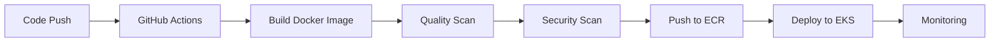

  

<h1 align="center">Hi 👋, I'm Deepak Kine</h1>

<h3 align="center">
🚀 DevOps Engineer | AWS | Docker | Kubernetes | Terraform | CI/CD
</h3>

  

💡 Building scalable cloud infrastructure | ⚙️ Automating deployments | 🔐 DevSecOps Enthusiast  

📍 India | 🎯 Open to DevOps / Cloud Engineer Roles

---

## 🧠 About Me  

✔ Hands-on with **AWS (EKS, EC2, S3, IAM, VPC, RDS, ECR)**  
✔ Containerization & orchestration using **Docker & Kubernetes (EKS, Minikube)**  
✔ CI/CD automation with **GitHub Actions & Jenkins**  
✔ Monitoring & observability using **Prometheus, Grafana & CloudWatch**  
✔ DevSecOps practices using **Trivy & SonarQube**  
✔ Strong in **Linux, Shell Scripting & Server Management**  
✔ Experience with **Nginx, Apache HTTPD & reverse proxy setups**  

📫 **Connect with me:**  
[LinkedIn](https://www.linkedin.com/in/deepak-kine-10666b32a/) | [Email](mailto:kinedeepak@outlook.com) | 

Phone
: +91 72648 32029

---

## 📄 Resume  

---

## 🚀 Core Expertise  

- ☁️ AWS Cloud Infrastructure (EKS, EC2, VPC, IAM)  
- ⚙️ CI/CD Automation (GitHub Actions, Jenkins)  
- 🐳 Containerization (Docker, Kubernetes)  
- 📊 Monitoring & Observability (Prometheus, Grafana)  
- 🔐 DevSecOps (Trivy, SonarQube)  

---

## 🧰 Tech Stack

| Category | Tools |
|-----------|--------|
| ☁️ Cloud | AWS (EC2, S3, EKS, RDS, CloudFront, IAM, VPC) |
| 🐳 Containers | Docker, Kubernetes, Minikube |
| ⚙️ Automation | Terraform, Jenkins, GitHub Actions |
| 📊 Monitoring | Prometheus, Grafana, CloudWatch |
| 🌐 Web Servers | Nginx, Apache HTTPD |
| 💾 Databases | PGSQL, MongoDB |
| 💻 OS & CLI | Linux (Ubuntu), Bash scripting |

---

# 🧩 Featured Projects

# 🚀 Production-Ready AWS Three-Tier DevSecOps Platform

**Tech Stack:** AWS, Terraform, Amazon EKS, Docker, Kubernetes, GitHub Actions, Helm, NGINX Ingress, Amazon ECR, Prometheus, Grafana, Alertmanager, cert-manager, Trivy

🔗 **Repository:**
https://github.com/deepakkine/aws-three-tier-devsecops-platform

### 🛠️ Tools Used

- AWS (EKS, EC2, VPC, IAM, ECR, s3)
- Terraform
- Docker
- Kubernetes
- Helm
- GitHub Actions
- GitHub OIDC
- Amazon ECR
- NGINX Ingress Controller
- AWS Load Balancer Controller
- EBS CSI Driver
- cert-manager
- Let's Encrypt
- Prometheus
- Grafana
- Namecheap # DNS Server
- Alertmanager
- Metrics Server
- Trivy
- Linux
- Git

### 🚀 Highlights

- Provisioned complete AWS infrastructure using reusable Terraform modules
- Configured remote Terraform backend using Amazon S3 and DynamoDB state locking
- Built highly available Amazon EKS cluster with managed node groups
- Implemented GitHub OIDC authentication eliminating long-lived AWS credentials
- Containerized a React frontend and Node.js backend using Docker
- Published versioned container images to Amazon ECR automatically
- Designed reusable Helm charts for Kubernetes deployments
- Automated CI/CD using GitHub Actions with build, security scan, image push and deployment stages
- Integrated Trivy filesystem and container image vulnerability scanning
- Configured NGINX Ingress Controller with AWS Network Load Balancer
- Automated HTTPS certificate provisioning using cert-manager and Let's Encrypt
- Integrated Prometheus, Grafana, Alertmanager and Metrics Server for monitoring and observability
- Configured persistent storage using Amazon EBS CSI Driver
- Implemented Infrastructure as Code for Kubernetes add-ons including Ingress, Monitoring and ClusterIssuer
- Added workflow concurrency protection to prevent simultaneous Helm deployments
- Documented deployment architecture, troubleshooting guide and operational runbooks

### 🔧 Real-World Challenges Solved

- Configured GitHub OIDC authentication with IAM Roles
- Resolved ClusterIssuer creation and certificate provisioning issues
- Fixed Let's Encrypt HTTP-01 challenge failures
- Solved DNS propagation and HTTPS certificate generation issues
- Configured AWS Load Balancer Controller with IAM Roles for Service Accounts (IRSA)
- Resolved Kubernetes provider timeout during Terraform destroy
- Eliminated Helm deployment lock errors using GitHub Actions concurrency
- Automated ClusterIssuer provisioning through Terraform
- Implemented production-style repository structure and reusable Terraform modules

### 📈 Impact

- Automated complete infrastructure provisioning and application deployment
- Enabled secure passwordless GitHub to AWS authentication using OIDC
- Reduced manual deployment effort through Infrastructure as Code
- Implemented production-ready Kubernetes deployment workflow
- Added automated vulnerability scanning to CI/CD
- Enabled secure HTTPS access with automatic certificate renewal
- Improved application observability with centralized monitoring
- Built a reusable DevSecOps platform following cloud-native best practices

  
  
  
  
  
  
  
  

  

  

---

# 🚀 End-to-End DevOps Automation on AWS EKS

**Tech Stack:** AWS EKS, Terraform, Kubernetes, Docker, GitHub Actions, ArgoCD, Amazon ECR, Trivy, MySQL, HPA, PVC

🔗 **Repository:**  
https://github.com/deepakkine/terraform-eks-githubactions-argocd

### 🛠️ Tools Used

- AWS (EKS, ECR, IAM, VPC, EC2, CloudWatch)
- Terraform
- Kubernetes
- Docker
- GitHub Actions
- ArgoCD
- Amazon ECR
- Trivy
- MySQL
- Apache HTTPD
- PHP 8.2
- CodeIgniter 4
- Linux
- Git

### 🚀 Highlights

- Provisioned AWS infrastructure using reusable Terraform modules
- Created Amazon EKS cluster with managed worker nodes
- Built and optimized Docker images using multi-stage Docker builds
- Automated CI/CD pipeline using GitHub Actions
- Integrated Trivy security scanning into the deployment workflow
- Pushed container images to Amazon ECR with automated versioning
- Implemented GitOps continuous deployment using ArgoCD
- Deployed a CodeIgniter E-Commerce application on Kubernetes
- Configured ConfigMaps, Secrets, Persistent Volumes, and Horizontal Pod Autoscaler
- Implemented rolling updates, readiness probes, and liveness probes
- Performed end-to-end troubleshooting of Kubernetes, ArgoCD, Docker, Apache, and database connectivity issues
- Created detailed deployment documentation, architecture diagrams, and operational runbooks

### 📈 Impact

- Automated complete infrastructure provisioning and application deployment lifecycle
- Enabled GitOps-driven deployments with ArgoCD synchronization
- Improved deployment consistency and rollback capability
- Added container vulnerability scanning using Trivy
- Reduced manual deployment effort through CI/CD automation
- Implemented scalable Kubernetes workloads with HPA and persistent storage

  
  
  
  
  
  

  

  

---

## 🏗️ AWS Infrastructure Automation with Terraform and Jenkins

**Tech Stack:** AWS, Terraform, Jenkins, GitHub, S3 Remote Backend, EC2, VPC

🔗 **Repository:**
https://github.com/deepakkine/aws-terraform-jenkins-infra

### 🛠️ Tools Used

* AWS (EC2, VPC, S3, IAM)
* Terraform
* Jenkins
* GitHub
* Linux
* Shell Scripting
* S3 Remote Backend
* Git

### 🚀 Highlights

* Built a Jenkins CI/CD pipeline to automate Terraform init, fmt, validate, plan, apply, and destroy
* Provisioned AWS infrastructure including VPC, public/private subnets, EC2, S3, route tables, and internet gateway
* Configured S3 remote backend with versioning enabled for Terraform state management
* Implemented separate development and production environments
* Optimized development infrastructure by removing NAT Gateway to reduce AWS costs
* Automated infrastructure provisioning directly from GitHub commits
* Implemented infrastructure cleanup through a dedicated destroy pipeline
* Resolved real-world issues including AWS provider version mismatches, Jenkins disk threshold warnings, and workspace storage issues

### 📈 Impact

* Automated the complete AWS infrastructure lifecycle
* Improved Terraform state management and collaboration
* Reduced manual provisioning effort
* Increased infrastructure consistency and repeatability
* Enabled cost-optimized environment management

  
  
  
  

  

  

---

## 🚀 GitOps Deployment on AWS EKS using ArgoCD

**Tech Stack:** AWS EKS, Kubernetes, Docker, ArgoCD, GitHub Actions, Helm, Amazon ECR

🔗 **Repository:**
https://github.com/deepakkine/devops-eks-argocd-assignment

### 🛠️ Tools Used

* AWS EKS
* Kubernetes
* Docker
* ArgoCD
* GitHub Actions
* Helm
* Amazon ECR
* Linux
* Git

### 🚀 Highlights

* Implemented complete GitOps workflow using ArgoCD
* Automated Kubernetes deployments using GitHub Actions
* Built and pushed Docker images securely to Amazon ECR
* Managed Kubernetes manifests declaratively
* Configured Kubernetes services, ingress, and application routing
* Implemented continuous synchronization between Git repository and Kubernetes cluster
* Automated deployment validation and rollback capabilities
* Used Helm charts for Kubernetes application management

### 📈 Impact

* Reduced manual Kubernetes deployment effort
* Improved deployment consistency and reliability
* Enabled GitOps-based continuous delivery
* Improved rollback and recovery capabilities
* Increased deployment visibility and traceability

  
  
  
  

  

---

## 🧠 APIX (APISecurist)

**Tech Stack:** AWS, EKS, Docker, Kubernetes, Terraform, Jenkins, GitHub Actions

### 🛠️ Tools Used

* AWS
* Amazon EKS
* Docker
* Kubernetes
* Terraform
* GitHub Actions
* Trivy
* SonarQube
* Prometheus
* Grafana
* Ansible
* NGINX Ingress

### 🚀 Highlights

* Built end-to-end CI/CD pipelines for microservices deployments
* Migrated applications from Docker Compose to Kubernetes on EKS
* Integrated Trivy and SonarQube for security and code quality validation
* Implemented Kubernetes ingress and load balancing
* Configured Prometheus and Grafana monitoring stack
* Automated infrastructure provisioning using Terraform and Ansible
* Improved deployment standardization across environments
* Implemented container security best practices

### 📈 Impact

* Reduced manual deployment effort by approximately 70%
* Improved release reliability and deployment consistency
* Enhanced security posture through automated scanning
* Increased application scalability and availability
* Improved observability and operational visibility

  
  
  
  

---

## 🔁 Web Hosting Comparison (Nginx vs Apache)

**Tech Stack:** Linux, Nginx, Apache HTTPD

### 🛠️ Tools Used

* Ubuntu Linux
* Nginx
* Apache HTTPD
* Shell Commands
* Networking

### 🚀 Highlights

* Hosted the same web application using Nginx and Apache HTTPD
* Configured Nginx as a reverse proxy server
* Configured Apache HTTPD for serving dynamic content
* Compared performance, configuration, and resource utilization
* Analyzed request flow and reverse proxy architecture

### 📈 Impact

* Improved understanding of web server architecture
* Gained hands-on experience with reverse proxy configurations
* Learned practical differences between Nginx and Apache deployments
---
## 🌱 Currently Learning  

- Advanced Kubernetes (Helm, HPA)  
- GitOps (ArgoCD)  
- Cloud Security & DevSecOps practices  
- Platform Engineering
---

## 📈 GitHub Analytics

  

  

  

---

## 🏆 Trophies  

---

## 🛠️ Badges  

---
## ⚙️ CI/CD Pipeline Flow  

```mermaid
flowchart LR
    A[Code Push] --> B[GitHub Actions]
    B --> C[Build Docker Image]
    C --> D[Quality Scan]
    D --> E[Security Scan]
    E --> F[Push to ECR]
    F --> G[Deploy to EKS]
    G --> H[Monitoring]
```

  

---

## 📊 Activity Graph  

---

## 👀 Visitor Counter  

---

## 💬 Daily DevOps Quote  

